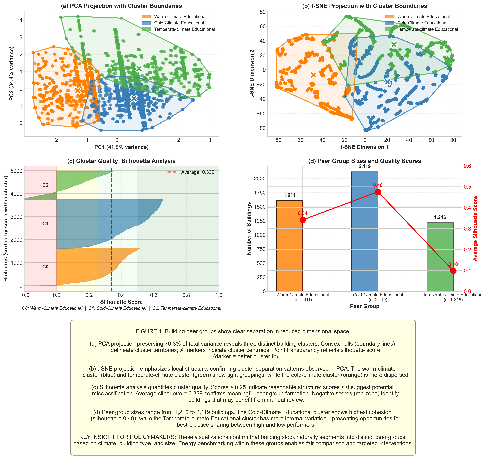

# Impact Brief: Building Energy Peer Group Analysis
**Clustering-Based Prioritization for Retrofit Investments**

*Version: 18 January 2026*

---

## Executive Summary

### The Problem
Commercial buildings account for **34% of global energy-related CO₂ emissions**. Traditional benchmarking compares buildings against broad averages, leading to unfair assessments and misdirected retrofit investments. A laboratory in Arizona cannot be meaningfully compared to an office building in Minnesota using the same energy standard.

### Our Approach
Using unsupervised machine learning on 4,946 buildings from the Building Data Genome Project 2 (Miller et al., 2020), we developed **data-driven peer groups** that enable fair energy benchmarking by comparing buildings with similar structural, operational, and climatic characteristics.

### Key Findings

| Finding | Implication |
|---------|-------------|
| **Three distinct peer groups** emerged based on climate, building type, and size | Benchmarking should be peer-group-specific, not portfolio-wide |
| **Climate is the primary differentiator** (η² = 0.45, p < 0.001) | Buildings must be compared within similar climate zones |
| **18.4% of buildings (912) underperform** their peer group median | Targeted interventions can focus on the worst performers |
| **Cold-Climate buildings show lowest median EUI** (115 kWh/m²/yr) | Heating-dominant climates may have better insulation and efficiency practices |

### Recommended Actions

1. **For Policymakers:** Adopt peer-group-based efficiency standards rather than single-threshold mandates (see Section 3.1)
2. **For Building Owners:** Benchmark against climate-appropriate peers; prioritize audits for buildings >1 standard deviation above peer median (see Section 3.2)


---

## 1. Problem Statement and Motivation

### 1.1 The Global Context

The building sector's energy consumption reached record levels in 2024, with operational emissions accounting for nearly **10 gigatonnes of CO₂** (UNEP, 2025). As global building stock is projected to double by 2050, improving energy efficiency in existing buildings represents one of the most cost-effective decarbonization strategies available.

### 1.2 The Benchmarking Problem

Current energy benchmarking approaches suffer from an important limitation: **unfair comparisons**. When an educational building is compared against an industry-wide average that includes warehouses and office buildings, the resulting benchmark provides little actionable insight.

**Traditional Approach:**
```
Building EUI → Compare to Industry Average → Label as "Good" or "Bad"
```

**Our Approach:**
```
Building EUI → Assign to Peer Group → Compare to Similar Buildings → Identify True Outliers
```

### 1.3 Research Objective

> **Segment commercial buildings by structural characteristics, usage type, and climatic context to develop a data-driven prioritization matrix for identifying and profiling efficiency outliers.**

---

## 2. Key Findings

### 2.1 Three Distinct Peer Groups Emerge

The analysis identified three statistically robust peer groups using K-Prototypes clustering, validated by hierarchical clustering (Adjusted Rand Index = 0.51). Figure 1 below visualizes the cluster separation.

| Peer Group | Buildings | Avg Temperature | Dominant Type | Median EUI |
|------------|-----------|-----------------|---------------|------------|
| **Warm-Climate Educational** | 1,611 (33%) | 22–23°C | Education | Highest (183 kWh/m²/yr) |
| **Cold-Climate Educational** | 2,119 (43%) | 11–12°C | Education | Lowest (115 kWh/m²/yr) |
| **Temperate-Climate Educational** | 1,216 (25%) | 14–15°C | Education | Moderate (122 kWh/m²/yr) |



*Dimensionality reduction (PCA and t-SNE) reveals three distinct peer groups. Convex hulls delineate cluster boundaries; minimal overlap confirms meaningful separation.*

**Statistical Validation:**
- Hopkins Statistic: 0.948 (strong clustering tendency; >0.75 indicates non-random structure)
- Silhouette Score: 0.34 (moderate separation)
- Cross-algorithm agreement: Moderate (ARI = 0.51)

### 2.2 Climate Dominates Peer Group Formation

The temperature difference across cluster centroids exceeds 10°C, with a large effect size (η² = 0.45). This confirms that climate (measured as average air temperature) should be the primary stratification factor in any benchmarking system (see Figure 2 below for statistical details).


*This figure from the analysis shows z-scored cluster characteristics with statistical significance. Warm-Climate Educational and Cold-Climate Educational differ by approximately 1.8 standard deviations on temperature.*

### 2.3 Building Type and Size Provide Additional Separation


While education and office buildings do not form entirely separate clusters, chi-square analysis shows a statistically significant association between building type and cluster membership (p < 0.001). Building type acts as a secondary differentiator within climate zones.

### 2.4 Energy Performance Varies Significantly Within Peer Groups

Across all peer groups, 912 buildings (18.4%) exceed their peer group median EUI by more than one standard deviation. These "efficiency outliers" represent the highest-impact targets for retrofit intervention.

| Peer Group | Underperformers | Top Performers | Improvement Potential |
|------------|-----------------|----------------|----------------------|
| Warm-Climate Educational | 21% | 18% | High (cooling optimization) |
| Cold-Climate Educational | 19% | 21% | Moderate (heating efficiency) |
| Temperate-Climate Educational | 14% | 25% | Low (operational fine-tuning; look elsewhere: consider lighting & plug loads) |

---

## 3. Audience-Specific Recommendations

### 3.1 For Policymakers and Regulators

**Key Message:** One-size-fits-all efficiency standards disadvantage buildings in extreme climates and fail to identify true underperformers (see Section 2.2).

**Recommended Actions:**

1. **Adopt tiered efficiency standards** based on climate zone and building type
   - Warm-climate buildings face inherent cooling demands; standards should reflect this baseline
   - Cold-climate standards should account for heating degree days

2. **Implement peer-group-based disclosure requirements**
   - Require buildings to report their EUI relative to peer group median, not just absolute values
   - This enables fair comparison and identifies true improvement opportunities

3. **Target retrofit subsidies to verified underperformers**
   - Use peer group analysis to identify the 18% of buildings that significantly underperform similar structures
   - Prioritize these buildings for subsidized audits and retrofit financing

**Policy Impact Estimate:**
If the top 20% of underperformers in each peer group improved to peer median, total energy savings could reach **50–100 GWh/year** across the analyzed building stock.

### 3.2 For Building Owners and Asset Managers

**Key Message:** Your building's energy performance should be judged against similar buildings, not industry averages.

**Recommended Actions:**

1. **Identify your peer group**
   - Determine your building's climate zone, primary use type, and size category
   - Request peer-group-specific benchmarking from energy consultants

2. **Assess your relative performance**
   - If your EUI is >1 standard deviation above peer median: **Priority audit recommended**
   - If your EUI is near peer median: **Monitor and optimize operations**
   - If your EUI is below peer median: **Document best practices for portfolio sharing**

3. **Set realistic improvement targets**
   - Peer group median represents an achievable target (50% of similar buildings already meet it)
   - Top-quartile performance within peer group represents an aspirational target

**Decision Matrix:**

| Your Position | Recommended Action | Expected ROI |
|---------------|-------------------|--------------|
| >1 SD above peer median | Comprehensive energy audit | High |
| Within 1 SD of median | Operational optimization | Moderate |
| Below peer median | Best practice documentation | Portfolio value |

---

## 4. Limitations and Caveats

### 4.1 Data Limitations

| Limitation | Impact | Mitigation |
|------------|--------|------------|
| **Temporal scope** | 2016–2017 data may not reflect current building stock | Findings should be validated with recent data |
| **Geographic bias** | 80.8% US buildings; European patterns may differ | Apply methodology to regional datasets |
| **Missing variables** | 52.9% missing year-built data; imputation applied | Results are robust to imputation method choice |

### 4.2 Methodological Limitations

| Limitation | Impact | Mitigation |
|------------|--------|------------|
| **Flat clustering** | Assumes k=3 is optimal; alternative k values yield different groupings | Sensitivity analysis conducted for k=3–8 |
| **Feature selection** | Results depend on included features | Selected features based on domain knowledge and data availability |
| **Cross-method agreement** | ARI = 0.51 indicates moderate (not strong) consensus | Profile confidence rated as MODERATE |

### 4.3 Generalization Caveats

- Peer groups derived from this dataset may not transfer directly to other building portfolios
- Local factors (energy prices, regulations, building codes) influence energy performance beyond the features analyzed
- Cluster boundaries are probabilistic; buildings near boundaries may reasonably belong to adjacent groups

---

## 5. Ethical Considerations

### 5.1 Fairness

- Peer group assignment should not disadvantage buildings based on factors outside owner control
- Climate-based grouping acknowledges that baseline energy requirements differ by geography
- Age-based differentiation recognizes that older buildings may face structural efficiency constraints

### 5.2 Privacy

- Analysis uses aggregated, anonymized building-level data
- No individual tenant or occupant information is processed
- Site identifiers are anonymized in the source dataset

### 5.3 Potential for Misuse

- Peer group labels should not be used to stigmatize buildings or owners
- Underperformer identification should inform support and incentives, not penalties
- Results should be communicated with appropriate uncertainty (MODERATE confidence)

### 5.4 Appropriate Use Cases

| Appropriate | Not Appropriate |
|-------------|-----------------|
| Informing retrofit prioritization | Mandating penalties without verification |
| Setting peer-relative benchmarks | Making absolute efficiency claims |
| Guiding subsidy allocation | Comparing buildings across peer groups |
| Supporting green finance decisions | Individual building valuation without inspection |


---

## 6. References

- Alrasheed, M., & Mourshed, M. (2024). Building stock modelling using k-prototype algorithm. *Energy and Buildings*, 311, 114111.
- Miller, C., et al. (2020). The Building Data Genome Project 2. *Scientific Data*, 7, 368. https://doi.org/10.1038/s41597-020-00712-x
- UN Environment Programme. (2025). *Global Status Report for Buildings and Construction 2024/2025*.

---

## Appendix: Technical Summary

| Parameter | Value |
|-----------|-------|
| Dataset | Building Data Genome Project 2 (BDG2) |
| Sample Size | 4,946 buildings (after cleaning) |
| Clustering Algorithm | K-Prototypes (primary); Hierarchical + Gower (validation) |
| Number of Clusters | k = 3 |
| Features | 6 (3 numerical: sqm, yearbuilt, Avg_AirTemp_Annual; 3 categorical: primaryspaceusage, region, meter) |
| Hopkins Statistic | 0.948 |
| Silhouette Score | 0.34 |
| Adjusted Rand Index | 0.51 |
| Profile Confidence | MODERATE |

---

*For detailed methodology, see [clustering.ipynb](jupyter_notebooks/clustering.ipynb). For problem framing, see [problem_framing.md](problem_framing.md). For ethical framework, see [ETHICS_FRAMEWORK.md](ETHICS_FRAMEWORK.md).*
